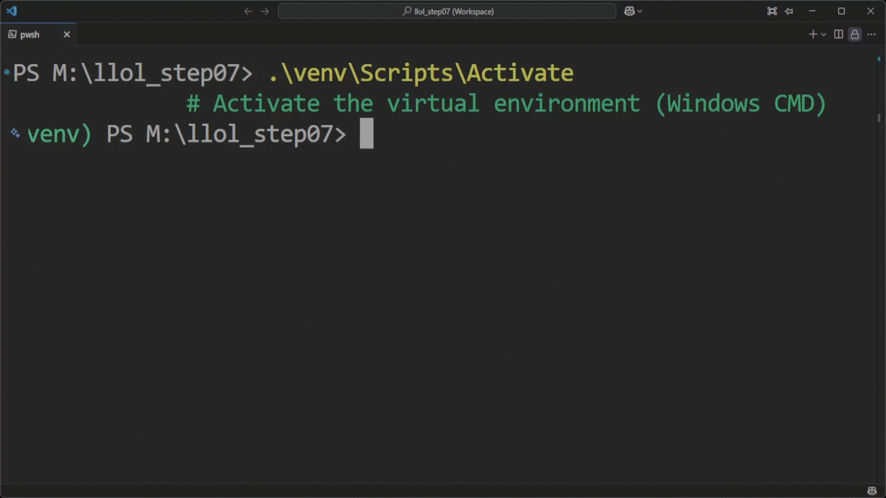

## 🌐 Internationalization (i18n)

This project supports full multilingual content through dynamic extraction and translation of interface text.

### 🔤 Install Dependencies

Before generating translation files, install the required packages:

```bash
pip install flask-babel deep-translator polib
```

These are used to:
- Extract translatable strings (`flask-babel`)
- Auto-translate new entries (`deep-translator`)
- Manage `.po` files (`polib`)

---

### 🛠️ Generate Translation Files

Run the following command to extract and translate strings:

```bash
py -m main.i18n_translate  # auto-generate .po files
```

This will:
- Extract all `gettext` strings from Python and Jinja templates
- Create or update `.po` files per language
- Generate the `.pot` template file
- Optionally auto-translate missing entries

📁 Output structure:

```bash
translations/
├── ar/
│   └── LC_MESSAGES/messages.po
├── de/
│   └── LC_MESSAGES/messages.po
└── messages.pot
```

> 💡 If the `translations/` folder doesn't exist, it will be created automatically.

---

### 🎬 Demo

<p align="center">
  <a href="screenshots/i18n_translate.gif">
    
  </a>
</p>

> 📽️ A complete i18n workflow in one command: extraction, translation, and file generation.

---

### ✅ Tips

- You can configure supported languages through your `LanguageOption` table in the admin panel.
- Re-run the script after modifying any text with `gettext()` or adding new templates.
- `polib` is required for proper `.po` file generation.
